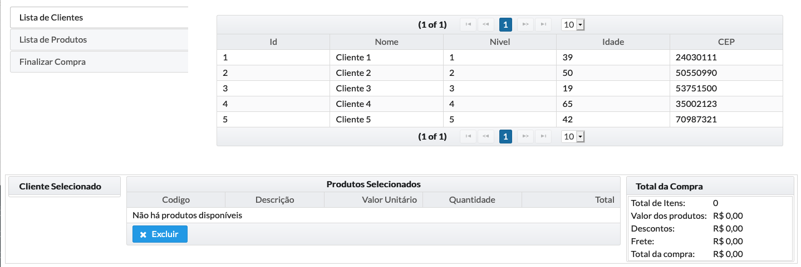

Loja Online Backend
===================

### Projeto backend consumindo regras de negócio do Red Hat Decision Manager 7

Github do projeto de regras [https://github.com/marcelomrwin/loja-online](https://github.com/marcelomrwin/loja-online)

#### Inicie um banco Postgres utilizando docker
docker run --rm -d -p 5432:5432 -e POSTGRESQL\_USER=lojaonline -e POSTGRESQL\_PASSWORD=lojaonline -e POSTGRESQL\_DATABASE=lojaonline -e POSTGRESQL\_ADMIN_PASSWORD=lojaonline -v ~/data/postgres:/var/lib/postgresql/data registry.access.redhat.com/rhscl/postgresql-10-rhel7

_obs: caso deseje utilizar uma instância local certifique-se das credenciais de acesso para usuário e senha bem como o host_

_Remova <b>-v ~/data/postgres:/var/lib/postgresql/data</b> se você não precisar de um volume de persistência_

#### Execute a applicação através do maven
```
mvn spring-boot:run
```

#### Acesse a API swagger
[http://localhost:8090/swagger-ui.html](http://localhost:8090/swagger-ui.html)

#### Acesse a aplicação
[http://localhost:8090](http://localhost:8090)


Esta é a tela da aplicação de exemplo

O fluxo de testes da aplicação é:
1. Lista de Clientes &rarr; Selecionar um Cliente &rarr; *Escolha um cliente da lista*
2. Lista de Produtos &rarr; Selecionar um item da lista &rarr; Verifique a quantidade &rarr; Clique em **Adicionar** *(Insira pelo menos um item da lista de produtos)*

A medida que o botão adicionar é acionado o sistema invoca o motor de regras para realizar o cálculo do total da compra.
